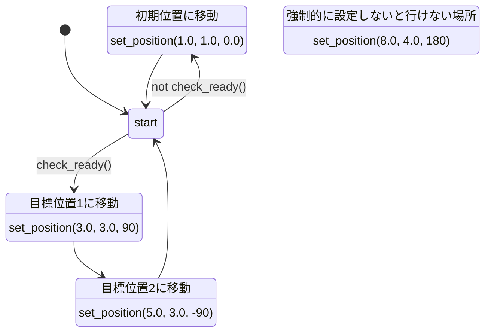

```mermaid
stateDiagram-v2

    position_0 : 初期位置に移動
    position_0 : set_position(1.0, 1.0, 0.0)

    position_1 : 目標位置1に移動
    position_1 : set_position(3.0, 3.0, 90)

    position_2 : 目標位置2に移動
    position_2 : set_position(5.0, 3.0, -90)


    [*] --> start
    start --> position_0 : not check_ready()
    position_0 --> start

    start --> position_1 : check_ready()
    position_1 --> position_2
    position_2 --> start
    
    position_3 : 強制的に設定しないと行けない場所
    position_3 : set_position(8.0, 4.0, 180)
```
