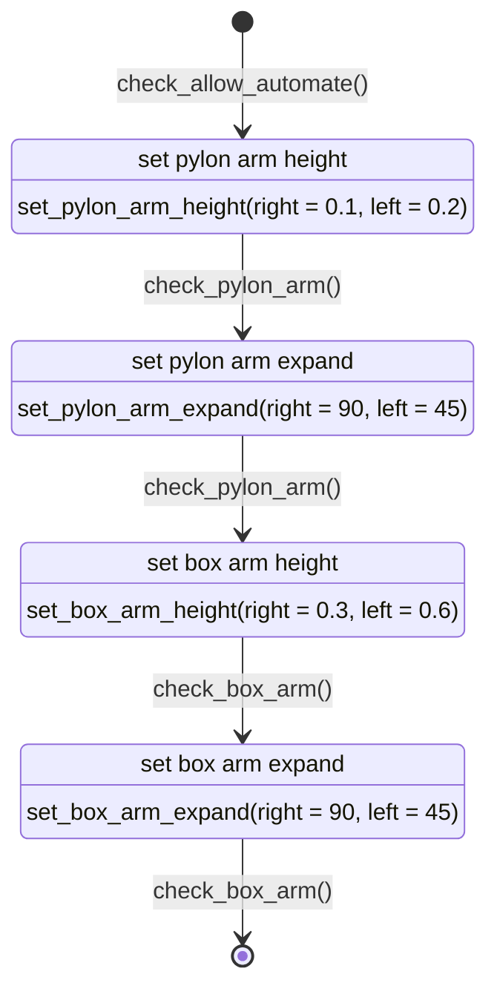

```mermaid
stateDiagram-v2

    pylon_height : set pylon arm height
    pylon_height : set_pylon_arm_height(right = 0.1, left = 0.2)

    pylon_expand : set pylon arm expand
    pylon_expand : set_pylon_arm_expand(right = 90, left = 45)

    box_arm_height : set box arm height
    box_arm_height : set_box_arm_height(right = 0.3, left = 0.6)

    box_arm_expand : set box arm expand
    box_arm_expand : set_box_arm_expand(right = 90, left = 45)

    [*] --> pylon_height : check_allow_automate()
    pylon_height --> pylon_expand : check_pylon_arm()
    pylon_expand --> box_arm_height : check_pylon_arm()
    box_arm_height --> box_arm_expand : check_box_arm()
    box_arm_expand --> [*] : check_box_arm()
```