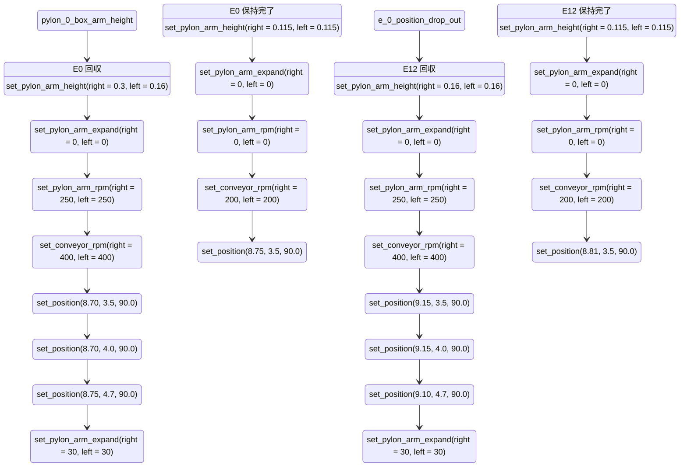

```mermaid
stateDiagram-v2
    e_0_pylon_height_init : E0 回収
    e_0_pylon_height_init : set_pylon_arm_height(right = 0.3, left = 0.16)
    e_0_pylon_expand_init : set_pylon_arm_expand(right = 0, left = 0)
    e_0_pylon_rpm_init    : set_pylon_arm_rpm(right = 250, left = 250)
    e_0_conveyor_init     : set_conveyor_rpm(right = 400, left = 400)
    e_0_position_init_0   : set_position(8.70, 3.5, 90.0)
    e_0_position_init_1   : set_position(8.70, 4.0, 90.0)
    e_0_position_get      : set_position(8.75, 4.7, 90.0)
    e_0_pylon_expand_get  : set_pylon_arm_expand(right = 30, left = 30)

    pylon_0_box_arm_height --> e_0_pylon_height_init
    e_0_pylon_height_init  --> e_0_pylon_expand_init
    e_0_pylon_expand_init  --> e_0_pylon_rpm_init
    e_0_pylon_rpm_init     --> e_0_conveyor_init
    e_0_conveyor_init      --> e_0_position_init_0
    e_0_position_init_0    --> e_0_position_init_1
    e_0_position_init_1    --> e_0_position_get
    e_0_position_get       --> e_0_pylon_expand_get


    e_0_pylon_height_hold : E0 保持完了
    e_0_pylon_height_hold : set_pylon_arm_height(right = 0.115, left = 0.115)
    e_0_pylon_expand_hold : set_pylon_arm_expand(right = 0, left = 0)
    e_0_pylon_rpm_hold    : set_pylon_arm_rpm(right = 0, left = 0)
    e_0_conveyor_hold     : set_conveyor_rpm(right = 200, left = 200)
    e_0_position_hold     : set_position(8.75, 3.5, 90.0)

    e_0_pylon_height_hold --> e_0_pylon_expand_hold
    e_0_pylon_expand_hold --> e_0_pylon_rpm_hold
    e_0_pylon_rpm_hold    --> e_0_conveyor_hold
    e_0_conveyor_hold     --> e_0_position_hold


    e_12_pylon_height_init : E12 回収
    e_12_pylon_height_init : set_pylon_arm_height(right = 0.16, left = 0.16)
    e_12_pylon_expand_init : set_pylon_arm_expand(right = 0, left = 0)
    e_12_pylon_rpm_init    : set_pylon_arm_rpm(right = 250, left = 250)
    e_12_conveyor_init     : set_conveyor_rpm(right = 400, left = 400)
    e_12_position_init_0   : set_position(9.15, 3.5, 90.0)
    e_12_position_init_1   : set_position(9.15, 4.0, 90.0)
    e_12_position_get      : set_position(9.10, 4.7, 90.0)
    e_12_pylon_expand_get  : set_pylon_arm_expand(right = 30, left = 30)

    e_0_position_drop_out  --> e_12_pylon_height_init
    e_12_pylon_height_init --> e_12_pylon_expand_init
    e_12_pylon_expand_init --> e_12_pylon_rpm_init
    e_12_pylon_rpm_init    --> e_12_conveyor_init
    e_12_conveyor_init     --> e_12_position_init_0
    e_12_position_init_0   --> e_12_position_init_1
    e_12_position_init_1   --> e_12_position_get
    e_12_position_get      --> e_12_pylon_expand_get


    e_12_pylon_height_hold : E12 保持完了
    e_12_pylon_height_hold : set_pylon_arm_height(right = 0.115, left = 0.115)
    e_12_pylon_expand_hold : set_pylon_arm_expand(right = 0, left = 0)
    e_12_pylon_rpm_hold    : set_pylon_arm_rpm(right = 0, left = 0)
    e_12_conveyor_hold     : set_conveyor_rpm(right = 200, left = 200)
    e_12_position_hold     : set_position(8.81, 3.5, 90.0)

    e_12_pylon_height_hold --> e_12_pylon_expand_hold
    e_12_pylon_expand_hold --> e_12_pylon_rpm_hold
    e_12_pylon_rpm_hold    --> e_12_conveyor_hold
    e_12_conveyor_hold     --> e_12_position_hold

```