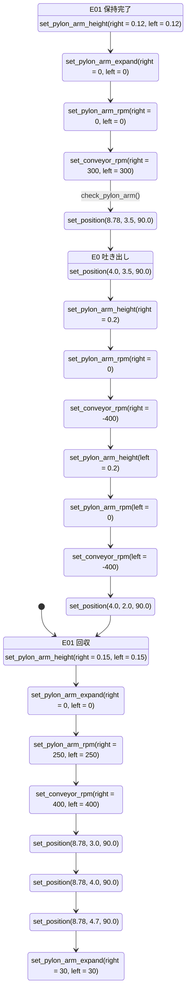

```mermaid
stateDiagram-v2    
    e_01_pylon_height_init : E01 回収
    e_01_pylon_height_init : set_pylon_arm_height(right = 0.15, left = 0.15)
    e_01_pylon_expand_init : set_pylon_arm_expand(right = 0, left = 0)
    e_01_pylon_rpm_init    : set_pylon_arm_rpm(right = 250, left = 250)
    e_01_conveyor_init     : set_conveyor_rpm(right = 400, left = 400)
    e_01_position_init_0   : set_position(8.78, 3.0, 90.0)
    e_01_position_init_1   : set_position(8.78, 4.0, 90.0)
    e_01_position_get      : set_position(8.78, 4.7, 90.0)
    e_01_pylon_expand_get  : set_pylon_arm_expand(right = 30, left = 30)

    [*] --> e_01_pylon_height_init
    e_01_pylon_height_init --> e_01_pylon_expand_init
    e_01_pylon_expand_init --> e_01_pylon_rpm_init
    e_01_pylon_rpm_init    --> e_01_conveyor_init
    e_01_conveyor_init     --> e_01_position_init_0
    e_01_position_init_0   --> e_01_position_init_1
    e_01_position_init_1   --> e_01_position_get
    e_01_position_get      --> e_01_pylon_expand_get


    e_01_pylon_height_hold : E01 保持完了
    e_01_pylon_height_hold : set_pylon_arm_height(right = 0.12, left = 0.12)
    e_01_pylon_expand_hold : set_pylon_arm_expand(right = 0, left = 0)
    e_01_pylon_rpm_hold    : set_pylon_arm_rpm(right = 0, left = 0)
    e_01_conveyor_hold     : set_conveyor_rpm(right = 300, left = 300)
    e_01_position_hold     : set_position(8.78, 3.5, 90.0)

    e_01_pylon_height_hold --> e_01_pylon_expand_hold
    e_01_pylon_expand_hold --> e_01_pylon_rpm_hold
    e_01_pylon_rpm_hold    --> e_01_conveyor_hold
    e_01_conveyor_hold     --> e_01_position_hold : check_pylon_arm()
    

    e_0_position_drop     : E0 吐き出し
    e_0_position_drop     : set_position(4.0, 3.5, 90.0)
    e_0_pylon_height_drop : set_pylon_arm_height(right = 0.2)
    e_0_pylon_rpm_drop    : set_pylon_arm_rpm(right = 0)
    e_0_conveyor_drop     : set_conveyor_rpm(right = -400)
    
    e_01_position_hold     --> e_0_position_drop
    e_0_position_drop     --> e_0_pylon_height_drop
    e_0_pylon_height_drop --> e_0_pylon_rpm_drop
    e_0_pylon_rpm_drop    --> e_0_conveyor_drop
    
    e_1_pylon_height_drop : set_pylon_arm_height(left = 0.2)
    e_1_pylon_rpm_drop    : set_pylon_arm_rpm(left = 0)
    e_1_conveyor_drop     : set_conveyor_rpm(left = -400)
    
    e_0_conveyor_drop     --> e_1_pylon_height_drop
    e_1_pylon_height_drop --> e_1_pylon_rpm_drop
    e_1_pylon_rpm_drop    --> e_1_conveyor_drop

    e_01_position_drop     : set_position(4.0, 2.0, 90.0)
    e_1_conveyor_drop --> e_01_position_drop
    e_01_position_drop --> e_01_pylon_height_init
```
