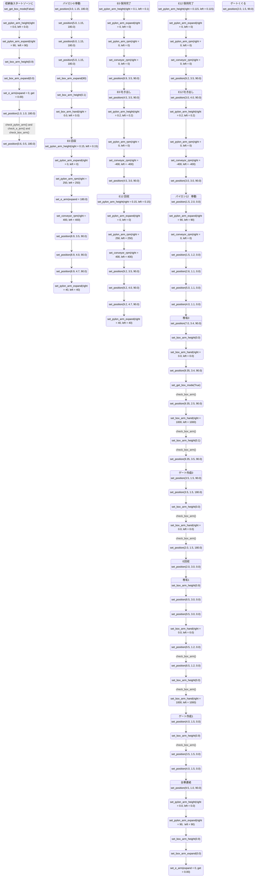

```mermaid
stateDiagram-v2

    start_get_box     : 収納後スタートゾーンに
    start_get_box        : set_get_box_mode(False)
    start_position_0     : set_position(1.0, 1.0, 180.0)
    start_pylon_height   : set_pylon_arm_height(right = 0.0, left = 0.0)
    start_pylon_expand   : set_pylon_arm_expand(right = 90,  left = 90)
    start_box_arm_height : set_box_arm_height(0.9)
    start_box_arm_expand : set_box_arm_expand(0.0)
    start_e_arm          : set_e_arm(expand = 0, get = 0.00)
    start_position_1     : set_position(0.6, 0.5, 180.0)

#    [*]                  --> start_get_box

    start_get_box        --> start_pylon_height
    start_pylon_height   --> start_pylon_expand
    start_pylon_expand   --> start_box_arm_height
    start_box_arm_height --> start_box_arm_expand
    start_box_arm_expand --> start_e_arm
    start_e_arm          --> start_position_0
    start_position_0     --> start_position_1 : check_pylon_arm() and check_e_arm() and check_box_arm()


    pylon_0_position_get   : パイロン0 移動
    pylon_0_position_get   : set_position(3.0, 1.15, 180.0)
    pylon_0_position_drop  : set_position(5.0, 1.15, 180.0)
    pylon_0_position_out_0 : set_position(6.0, 1.15, 180.0)
    pylon_0_position_out_1 : set_position(5.0, 1.15, 180.0)
    pylon_0_box_arm_expand : set_box_arm_expand(90)
    pylon_0_box_arm_height : set_box_arm_height(0.1)
    pylon_0_box_arm_hand   : set_box_arm_hand(right = 0.0, left = 0.0)

#    start_position_1       --> pylon_0_position_get
#    start_position_1       --> pylon_12_position_out
    
    pylon_0_position_get   --> pylon_0_position_drop
    pylon_0_position_drop  --> pylon_0_position_out_0
    pylon_0_position_out_0 --> pylon_0_position_out_1
    pylon_0_position_out_1 --> pylon_0_box_arm_expand
    pylon_0_box_arm_expand --> pylon_0_box_arm_height
    pylon_0_box_arm_height --> pylon_0_box_arm_hand
    

    e_0_pylon_height_init : E0 回収
    e_0_pylon_height_init : set_pylon_arm_height(right = 0.15, left = 0.15)
    e_0_pylon_expand_init : set_pylon_arm_expand(right = 0, left = 0)
    e_0_pylon_rpm_init    : set_pylon_arm_rpm(right = 250, left = 250)
    e_0_e_arm_expand      : set_e_arm(expand = 180.0)
    e_0_conveyor_init     : set_conveyor_rpm(right = 400, left = 400)
    e_0_position_init_0   : set_position(8.9, 3.5, 90.0)
    e_0_position_init_1   : set_position(8.9, 4.0, 90.0)
    e_0_position_get      : set_position(8.9, 4.7, 90.0)
    e_0_pylon_expand_get  : set_pylon_arm_expand(right = 40, left = 40)

    pylon_0_box_arm_hand   --> e_0_pylon_height_init
    e_0_pylon_height_init  --> e_0_pylon_expand_init
    e_0_pylon_expand_init  --> e_0_pylon_rpm_init
    e_0_pylon_rpm_init     --> e_0_e_arm_expand
    e_0_e_arm_expand       --> e_0_conveyor_init
    e_0_conveyor_init      --> e_0_position_init_0
    e_0_position_init_0    --> e_0_position_init_1
    e_0_position_init_1    --> e_0_position_get
    e_0_position_get       --> e_0_pylon_expand_get


    e_0_pylon_height_hold : E0 保持完了
    e_0_pylon_height_hold : set_pylon_arm_height(right = 0.1, left = 0.1)
    e_0_pylon_expand_hold : set_pylon_arm_expand(right = 0, left = 0)
    e_0_pylon_rpm_hold    : set_pylon_arm_rpm(right = 0, left = 0)
    e_0_conveyor_hold     : set_conveyor_rpm(right = 0, left = 0)
    e_0_position_hold     : set_position(8.9, 3.5, 90.0)

#    e_0_pylon_expand_get  --> e_0_pylon_height_hold : check_pylon_arm()

    e_0_pylon_height_hold --> e_0_pylon_expand_hold
    e_0_pylon_expand_hold --> e_0_pylon_rpm_hold
    e_0_pylon_rpm_hold    --> e_0_conveyor_hold
    e_0_conveyor_hold     --> e_0_position_hold
    

    e_0_position_drop     : E0 吐き出し
    e_0_position_drop     : set_position(4.5, 3.5, 90.0)
    e_0_pylon_height_drop : set_pylon_arm_height(right = 0.2, left = 0.2)
    e_0_pylon_rpm_drop    : set_pylon_arm_rpm(right = 0, left = 0)
    e_0_conveyor_drop     : set_conveyor_rpm(right = -400, left = -400)
    e_0_position_drop_out : set_position(4.5, 3.0, 90.0)
    
    e_0_position_hold    --> e_0_position_drop
    e_0_position_drop     --> e_0_pylon_height_drop
    e_0_pylon_height_drop --> e_0_pylon_rpm_drop
    e_0_pylon_rpm_drop    --> e_0_conveyor_drop
    e_0_conveyor_drop     --> e_0_position_drop_out
    

    e_12_pylon_height_init : E12 回収
    e_12_pylon_height_init : set_pylon_arm_height(right = 0.15, left = 0.15)
    e_12_pylon_expand_init : set_pylon_arm_expand(right = 0, left = 0)
    e_12_pylon_rpm_init    : set_pylon_arm_rpm(right = 250, left = 250)
    e_12_conveyor_init     : set_conveyor_rpm(right = 400, left = 400)
    e_12_position_init_0   : set_position(9.2, 3.5, 90.0)
    e_12_position_init_1   : set_position(9.2, 4.0, 90.0)
    e_12_position_get      : set_position(9.2, 4.7, 90.0)
    e_12_pylon_expand_get  : set_pylon_arm_expand(right = 40, left = 40)

    e_0_position_drop_out  --> e_12_pylon_height_init
    e_12_pylon_height_init --> e_12_pylon_expand_init
    e_12_pylon_expand_init --> e_12_pylon_rpm_init
    e_12_pylon_rpm_init    --> e_12_conveyor_init
    e_12_conveyor_init     --> e_12_position_init_0
    e_12_position_init_0   --> e_12_position_init_1
    e_12_position_init_1   --> e_12_position_get
    e_12_position_get      --> e_12_pylon_expand_get


    e_12_pylon_height_hold : E12 保持完了
    e_12_pylon_height_hold : set_pylon_arm_height(right = 0.115, left = 0.115)
    e_12_pylon_expand_hold : set_pylon_arm_expand(right = 0, left = 0)
    e_12_pylon_rpm_hold    : set_pylon_arm_rpm(right = 0, left = 0)
    e_12_conveyor_hold     : set_conveyor_rpm(right = 0, left = 0)
    e_12_position_hold     : set_position(9.2, 3.5, 90.0)

#    e_12_pylon_expand_get  --> e_12_pylon_height_hold : check_box_arm()

    e_12_pylon_height_hold --> e_12_pylon_expand_hold
    e_12_pylon_expand_hold --> e_12_pylon_rpm_hold
    e_12_pylon_rpm_hold    --> e_12_conveyor_hold
    e_12_conveyor_hold     --> e_12_position_hold


    e_12_position_drop     : E12 吐き出し
    e_12_position_drop     : set_position(3.0, 4.0, 90.0)
    e_12_pylon_height_drop : set_pylon_arm_height(right = 0.2, left = 0.2)
    e_12_pylon_rpm_drop    : set_pylon_arm_rpm(right = 0, left = 0)
    e_12_conveyor_drop     : set_conveyor_rpm(right = -400, left = -400)
    e_12_position_drop_out : set_position(3.0, 3.0, 90.0)
    
    e_12_position_hold     --> e_12_position_drop
    e_12_position_drop     --> e_12_pylon_height_drop
    e_12_pylon_height_drop --> e_12_pylon_rpm_drop
    e_12_pylon_rpm_drop    --> e_12_conveyor_drop
    e_12_conveyor_drop     --> e_12_position_drop_out


    pylon_12_position_setup_0 : パイロン12　移動
    pylon_12_position_setup_0 : set_position(1.5, 2.0, 0.0)
    pylon_12_pylon_expand     : set_pylon_arm_expand(right = 90, left = 90)
    pylon_12_conveyor_stop    : set_conveyor_rpm(right = 0, left = 0)
    pylon_12_position_setup_1 : set_position(1.5, 1.2, 0.0)

    e_12_position_drop_out    --> pylon_12_position_setup_0

    pylon_12_position_setup_0 --> pylon_12_pylon_expand
    pylon_12_pylon_expand     --> pylon_12_conveyor_stop
    pylon_12_conveyor_stop    --> pylon_12_position_setup_1


    pylon_12_position_get  : set_position(2.6, 1.1, 0.0)
    pylon_12_position_drop : set_position(5.0, 1.1, 0.0)
    pylon_12_position_out  : set_position(4.0, 1.1, 0.0)

    pylon_12_position_setup_1 --> pylon_12_position_get
    pylon_12_position_get     --> pylon_12_position_drop
    pylon_12_position_drop    --> pylon_12_position_out

    
    ex_0_init      : 専有0
    ex_0_init      : set_position(7.0, 3.4, 90.0)
    ex_0_height    : set_box_arm_height(0.0)
    ex_0_hand_init : set_box_arm_hand(right = 0.0, left = 0.0)
    ex_0_setup     : set_position(9.35, 3.4, 90.0)
    ex_0_mode      : set_get_box_mode(True)
    ex_0_get       : set_position(9.35, 2.5, 90.0)
    ex_0_hand_ok   : set_box_arm_hand(right = 1000, left = 1000)
    ex_0_height_ok : set_box_arm_height(0.1)
    ex_0_get_ok    : set_position(9.35, 3.5, 90.0)

    pylon_12_position_out --> ex_0_init
    ex_0_init             --> ex_0_height
    ex_0_height           --> ex_0_hand_init
    ex_0_hand_init        --> ex_0_setup
    ex_0_setup            --> ex_0_mode
    ex_0_mode             --> ex_0_get : check_box_arm()
    ex_0_get              --> ex_0_hand_ok
    ex_0_hand_ok          --> ex_0_height_ok : check_box_arm()
    ex_0_height_ok        --> ex_0_get_ok : check_box_arm()


    gate_0_init   : ゲート作成0
    gate_0_init   : set_position(3.5, 1.5, 90.0)
    gate_0_turn   : set_position(3.5, 1.5, 180.0)
    gate_0_height : set_box_arm_height(0.0)
    gate_0_hand   : set_box_arm_hand(right = 0.0, left = 0.0)
    gate_0_out    : set_position(2.0, 1.5, 180.0)

    ex_0_get_ok   --> gate_0_init
    gate_0_init   --> gate_0_turn
    gate_0_turn   --> gate_0_height
    gate_0_height --> gate_0_hand : check_box_arm()
    gate_0_hand   --> gate_0_out : check_box_arm()

    e_init : E回収
    e_init : set_position(2.0, 3.0, 0.0)
    
    gate_0_out --> e_init

    ex_1_height_init : 専有1
    ex_1_height_init : set_box_arm_height(0.9)
    ex_1_init        : set_position(8.5, 3.0, 0.0)
    ex_1_setup       : set_position(9.5, 3.0, 0.0)
    ex_1_hand_init   : set_box_arm_hand(right = 0.0, left = 0.0)
    ex_1_get         : set_position(9.5, 1.2, 0.0)
    ex_1_get_ok      : set_position(8.5, 1.2, 0.0)
    ex_1_height_ok   : set_box_arm_height(0.0)
    ex_1_hand_ok     : set_box_arm_hand(right = 1000, left = 1000)

    e_init           --> ex_1_height_init
    ex_1_height_init --> ex_1_init
    ex_1_init        --> ex_1_setup
    ex_1_setup       --> ex_1_hand_init
    ex_1_hand_init   --> ex_1_get
    ex_1_get         --> ex_1_get_ok : check_box_arm()
    ex_1_get_ok      --> ex_1_height_ok
    ex_1_height_ok   --> ex_1_hand_ok : check_box_arm()

    gate_1_init   : ゲート作成1
    gate_1_init   : set_position(4.0, 1.5, 0.0)
    gate_1_height : set_box_arm_height(0.9)
    gate_1_ok     : set_position(3.5, 1.5, 0.0)
    gate_1_out    : set_position(4.0, 1.5, 0.0)

    ex_1_hand_ok  --> gate_1_init
    gate_1_init   --> gate_1_height
    gate_1_height --> gate_1_ok : check_box_arm()
    gate_1_ok     --> gate_1_out

    people_setup : 台車連結
    people_setup : set_position(9.5, 1.0, 90.0)
    people_pylon_height   : set_pylon_arm_height(right = 0.0, left = 0.0)
    people_pylon_expand   : set_pylon_arm_expand(right = 90,  left = 90)
    people_box_arm_height : set_box_arm_height(0.9)
    people_box_arm_expand : set_box_arm_expand(0.0)
    people_e_arm          : set_e_arm(expand = 0, get = 0.00)
    
    people_gate           : ゲートくぐる
    people_gate           : set_position(2.0, 1.5, 90.0)

    gate_1_out            --> people_setup
    people_setup          --> people_pylon_height
    people_pylon_height   --> people_pylon_expand
    people_pylon_expand   --> people_box_arm_height
    people_box_arm_height --> people_box_arm_expand
    people_box_arm_expand --> people_e_arm
#    people_e_arm          --> people_gate : check_box_arm() and check_e_arm() and check_pylon_arm()
```
