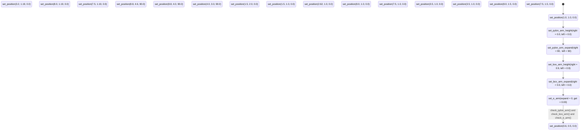

```mermaid
stateDiagram-v2

    start_position_0 : set_position(1.0, 1.0, 0.0)
    start_pylon_height : set_pylon_arm_height(right = 0.0, left = 0.0)
    start_pylon_expand : set_pylon_arm_expand(right = 90,  left = 90)
    start_box_arm_height : set_box_arm_height(right = 0.9, left = 0.9)
    start_box_arm_expand : set_box_arm_expand(right = 0.0, left = 0.0)
    start_e_arm : set_e_arm(expand = 0, get = 0.00)
    start_position_1 : set_position(0.6, 0.5, 0.0)
    


    position_pylon_0_get : set_position(3.2, 1.19, 0.0)
    position_pylon_0_drop : set_position(8.0, 1.19, 0.0)
    position_pylon_0_out : set_position(7.5, 1.19, 0.0)

    position_e_01_get : set_position(8.8, 4.6, 90.0)
    position_e_01_hold : set_position(8.8, 4.0, 90.0)
    position_e_01_drop : set_position(4.0, 3.0, 90.0)

    position_pylon_2_setup_0 : set_position(1.5, 2.0, 0.0)
    position_pylon_2_setup_1 : set_position(1.5, 1.0, 0.0)

    position_pylon_2_get : set_position(2.62, 1.0, 0.0)
    position_pylon_2_drop : set_position(8.0, 1.0, 0.0)
    position_pylon_2_out : set_position(7.5, 1.0, 0.0)

    position_pylon_3_setup : set_position(3.5, 1.0, 0.0)
    position_pylon_3_get : set_position(3.5, 1.0, 0.0)
    position_pylon_3_drop : set_position(8.0, 1.5, 0.0)
    position_pylon_3_out : set_position(7.5, 1.5, 0.0)

    [*] --> start_position_0
    start_position_0 --> start_pylon_height
    start_pylon_height --> start_pylon_expand
    start_pylon_expand --> start_box_arm_height
    start_box_arm_height --> start_box_arm_expand
    start_box_arm_expand --> start_e_arm
    start_e_arm --> start_position_1 : check_pylon_arm() and check_box_arm() and check_e_arm()
```
