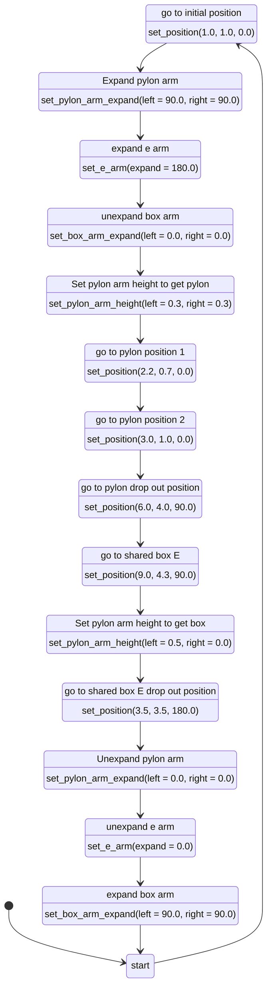

```mermaid
stateDiagram-v2

    position_initial : go to initial position
    position_initial : set_position(1.0, 1.0, 0.0)

    position_pylon_1 : go to pylon position 1
    position_pylon_1 : set_position(2.2, 0.7, 0.0)

    position_pylon_2 : go to pylon position 2
    position_pylon_2 : set_position(3.0, 1.0, 0.0)

    position_pylon_out : go to pylon drop out position
    position_pylon_out : set_position(6.0, 4.0, 90.0)

    position_shared_box_E : go to shared box E
    position_shared_box_E : set_position(9.0, 4.3, 90.0)

    position_shared_box_out_E : go to shared box E drop out position
    position_shared_box_out_E : set_position(3.5, 3.5, 180.0)

    pylon_expand : Expand pylon arm
    pylon_expand : set_pylon_arm_expand(left = 90.0, right = 90.0)

    get_pylon_height : Set pylon arm height to get pylon
    get_pylon_height : set_pylon_arm_height(left = 0.3, right = 0.3)

    pylon_unexpand : Unexpand pylon arm
    pylon_unexpand : set_pylon_arm_expand(left = 0.0, right = 0.0)

    box_pylon_height : Set pylon arm height to get box
    box_pylon_height : set_pylon_arm_height(left = 0.5, right = 0.0)

    e_arm_expand : expand e arm
    e_arm_expand : set_e_arm(expand = 180.0)

    e_arm_unexpand : unexpand e arm
    e_arm_unexpand : set_e_arm(expand = 0.0)

    box_arm_unexpand : unexpand box arm
    box_arm_unexpand : set_box_arm_expand(left = 0.0, right = 0.0)

    box_arm_expand : expand box arm
    box_arm_expand : set_box_arm_expand(left = 90.0, right = 90.0)

    [*] --> start
    start --> position_initial
    position_initial --> pylon_expand
    pylon_expand --> e_arm_expand
    e_arm_expand --> box_arm_unexpand
    box_arm_unexpand --> get_pylon_height
    get_pylon_height --> position_pylon_1
    position_pylon_1 --> position_pylon_2
    position_pylon_2 --> position_pylon_out
    position_pylon_out --> position_shared_box_E
    position_shared_box_E --> box_pylon_height
    box_pylon_height --> position_shared_box_out_E
    position_shared_box_out_E --> pylon_unexpand
    pylon_unexpand --> e_arm_unexpand
    e_arm_unexpand --> box_arm_expand
    box_arm_expand --> start
```
