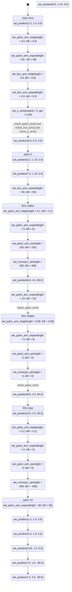

```mermaid
stateDiagram-v2

    start_position_0     : start zone
    start_position_0     : set_position(1.0, 1.0, 0.0)
    start_pylon_height   : set_pylon_arm_height(right = 0.0, left = 0.0)
    start_pylon_expand   : set_pylon_arm_expand(right = 90,  left = 90)
    start_box_arm_height : set_box_arm_height(right = 0.9, left = 0.9)
    start_box_arm_expand : set_box_arm_expand(right = 0.0, left = 0.0)
    start_e_arm          : set_e_arm(expand = 0, get = 0.00)
    start_position_1     : set_position(0.6, 0.5, 0.0)

    [*] --> start_position_0
    start_position_0     --> start_pylon_height
    start_pylon_height   --> start_pylon_expand
    start_pylon_expand   --> start_box_arm_height
    start_box_arm_height --> start_box_arm_expand
    start_box_arm_expand --> start_e_arm
    start_e_arm          --> start_position_1 : check_pylon_arm() and check_box_arm() and check_e_arm()


    pylon_0_position_get  : pylon 0
    pylon_0_position_get  : set_position(3.2, 1.19, 0.0)
    pylon_0_position_drop : set_position(7.0, 1.19, 0.0)
    pylon_0_position_out  : set_position(6.5, 1.19, 0.0)
    pylon_0_box_arm_expand    : set_box_arm_expand(right = 90, left = 90)

    start_position_1 --> pylon_0_position_get
    pylon_0_position_get  --> pylon_0_position_drop
    pylon_0_position_drop --> pylon_0_box_arm_expand
    

    e_01_pylon_height_init : E01 collect
    e_01_pylon_height_init : set_pylon_arm_height(right = 0.1, left = 0.1)
    e_01_pylon_expand_init : set_pylon_arm_expand(right = 0, left = 0)
    e_01_pylon_rpm_init    : set_pylon_arm_rpm(right = 150, left = 150)
    e_01_conveyor_init     : set_conveyor_rpm(right = 400, left = 400)
    e_01_position_get      : set_position(8.8, 4.6, 90.0)
    e_01_pylon_expand_get  : set_pylon_arm_expand(right = 10, left = 10)

    pylon_0_box_arm_expand --> e_01_pylon_height_init
    e_01_pylon_height_init --> e_01_pylon_expand_init
    e_01_pylon_expand_init --> e_01_pylon_rpm_init
    e_01_pylon_rpm_init    --> e_01_conveyor_init
    e_01_conveyor_init     --> e_01_position_get
    e_01_position_get      --> e_01_pylon_expand_get


    e_01_pylon_height_hold : E01 holded
    e_01_pylon_height_hold : set_pylon_arm_height(right = 0.08, left = 0.08)
    e_01_pylon_expand_hold : set_pylon_arm_expand(right = 0, left = 0)
    e_01_pylon_rpm_hold    : set_pylon_arm_rpm(right = 0, left = 0)
    e_01_conveyor_hold     : set_conveyor_rpm(right = 0, left = 0)
    e_01_position_hold     : set_position(8.8, 4.0, 90.0)

    e_01_pylon_expand_get  --> e_01_pylon_height_hold : check_pylon_arm()
    e_01_pylon_height_hold --> e_01_pylon_expand_hold
    e_01_pylon_expand_hold --> e_01_pylon_rpm_hold
    e_01_pylon_rpm_hold    --> e_01_conveyor_hold
    e_01_conveyor_hold     --> e_01_position_hold : check_pylon_arm()
    

    e_01_position_drop     : E01 drop
    e_01_position_drop     : set_position(4.0, 3.0, 90.0)
    e_01_pylon_height_drop : set_pylon_arm_height(right = 0.2, left = 0.2)
    e_01_pylon_expand_drop : set_pylon_arm_expand(right = 0, left = 0)
    e_01_pylon_rpm_drop    : set_pylon_arm_rpm(right = 0, left = 0)
    e_01_conveyor_drop     : set_conveyor_rpm(right = -400, left = -400)
    
    e_01_position_hold     --> e_01_position_drop
    e_01_position_drop     --> e_01_pylon_height_drop
    e_01_pylon_height_drop --> e_01_pylon_expand_drop
    e_01_pylon_expand_drop --> e_01_pylon_rpm_drop
    e_01_pylon_rpm_drop    --> e_01_conveyor_drop


    pylon_12_pylon_expand     : pylon 12
    pylon_12_pylon_expand     : set_pylon_arm_expand(right = 90, left = 90)
    pylon_12_position_setup_0 : set_position(1.5, 2.0, 0.0)
    pylon_12_position_setup_1 : set_position(1.5, 1.0, 0.0)

    e_01_conveyor_drop --> pylon_12_pylon_expand
    pylon_12_pylon_expand --> pylon_12_position_setup_0
    pylon_12_position_setup_0 --> pylon_12_position_setup_1


    pylon_12_position_get  : set_position(2.62, 1.0, 0.0)
    pylon_12_position_drop : set_position(7.0, 1.5, -90.0)
    pylon_12_position_out  : set_position(7.0, 2.0, -90.0)

    pylon_12_position_setup_1 --> pylon_12_position_get
    pylon_12_position_get     --> pylon_12_position_drop
    pylon_12_position_drop    --> pylon_12_position_out
```
