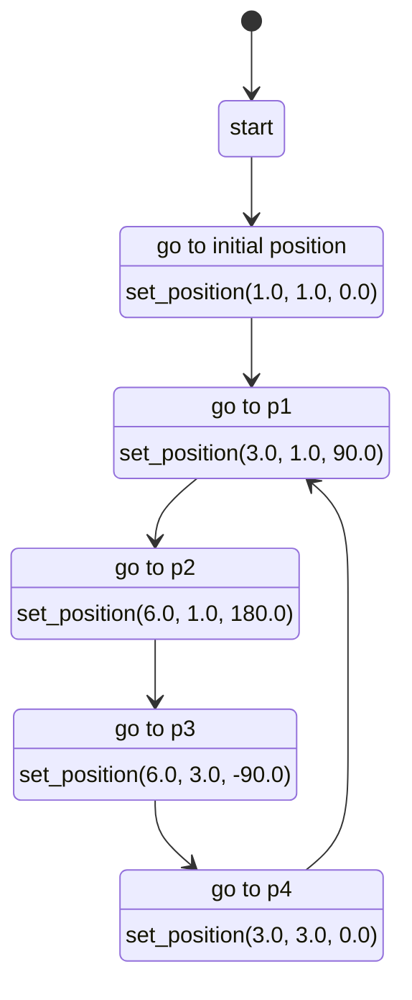

```mermaid
stateDiagram-v2

    pinit : go to initial position
    pinit : set_position(1.0, 1.0, 0.0)

    p1 : go to p1
    p1 : set_position(3.0, 1.0, 90.0)

    p2 : go to p2
    p2 : set_position(6.0, 1.0, 180.0)

    p3 : go to p3
    p3 : set_position(6.0, 3.0, -90.0)

    p4 : go to p4
    p4 : set_position(3.0, 3.0, 0.0)

    [*] --> start
    start --> pinit
    pinit --> p1
    p1 --> p2
    p2 --> p3
    p3 --> p4
    p4 --> p1
```
