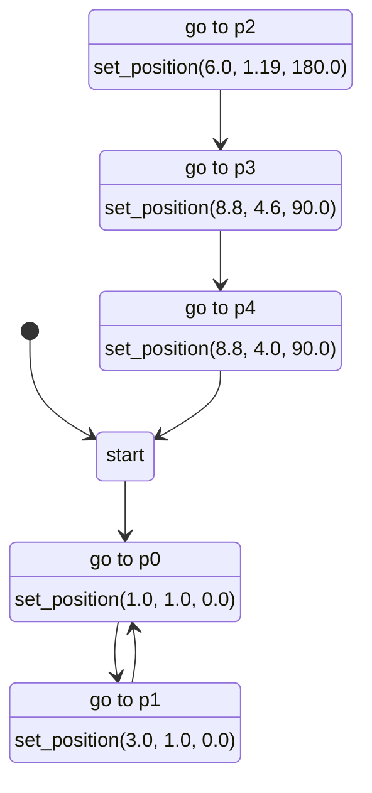

```mermaid
stateDiagram-v2

    p0 : go to p0
#    p0 : set_position(0.8, 0.8, 180.0)
    p0 : set_position(1.0, 1.0, 0.0)

    p1 : go to p1
#    p1 : set_position(3.2, 1.19, 180.0)
    p1 : set_position(3.0, 1.0, 0.0)

    p2 : go to p2
    p2 : set_position(6.0, 1.19, 180.0)

    p3 : go to p3
    p3 : set_position(8.8, 4.6, 90.0)

    p4 : go to p4
    p4 : set_position(8.8, 4.0, 90.0)

    [*] --> start
    start --> p0
    p0 --> p1
    p1 --> p0
    p2 --> p3
    p3 --> p4
    p4 --> start

```
