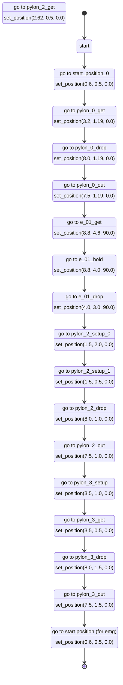

```mermaid
stateDiagram-v2

    start_position_emg : go to start position (for emg)
    start_position_emg : set_position(0.6, 0.5, 0.0)

    start_position_0 : go to start_position_0
    start_position_0 : set_position(0.6, 0.5, 0.0)

    pylon_0_get : go to pylon_0_get
    pylon_0_get : set_position(3.2, 1.19, 0.0)

    pylon_0_drop : go to pylon_0_drop
    pylon_0_drop : set_position(8.0, 1.19, 0.0)

    pylon_0_out : go to pylon_0_out
    pylon_0_out : set_position(7.5, 1.19, 0.0)

    e_01_get : go to e_01_get
    e_01_get : set_position(8.8, 4.6, 90.0)

    e_01_hold : go to e_01_hold
    e_01_hold : set_position(8.8, 4.0, 90.0)

    e_01_drop : go to e_01_drop
    e_01_drop : set_position(4.0, 3.0, 90.0)

    pylon_2_setup_0 : go to pylon_2_setup_0
    pylon_2_setup_0 : set_position(1.5, 2.0, 0.0)

    pylon_2_setup_1 : go to pylon_2_setup_1
    pylon_2_setup_1 : set_position(1.5, 0.5, 0.0)

    pylon_2_get : go to pylon_2_get
    pylon_2_get : set_position(2.62, 0.5, 0.0)

    pylon_2_drop : go to pylon_2_drop
    pylon_2_drop : set_position(8.0, 1.0, 0.0)

    pylon_2_out : go to pylon_2_out
    pylon_2_out : set_position(7.5, 1.0, 0.0)

    pylon_3_setup : go to pylon_3_setup
    pylon_3_setup : set_position(3.5, 1.0, 0.0)

    pylon_3_get : go to pylon_3_get
    pylon_3_get : set_position(3.5, 0.5, 0.0)

    pylon_3_drop : go to pylon_3_drop
    pylon_3_drop : set_position(8.0, 1.5, 0.0)

    pylon_3_out : go to pylon_3_out
    pylon_3_out : set_position(7.5, 1.5, 0.0)


    [*] --> start
    start --> start_position_0
    start_position_0 --> pylon_0_get
    pylon_0_get --> pylon_0_drop
    pylon_0_drop --> pylon_0_out
    pylon_0_out --> e_01_get
    e_01_get --> e_01_hold
    e_01_hold --> e_01_drop
    e_01_drop --> pylon_2_setup_0
    pylon_2_setup_0 --> pylon_2_setup_1
    pylon_2_setup_1 --> pylon_2_drop
    pylon_2_drop --> pylon_2_out
    pylon_2_out --> pylon_3_setup
    pylon_3_setup --> pylon_3_get
    pylon_3_get --> pylon_3_drop
    pylon_3_drop --> pylon_3_out
    pylon_3_out --> start_position_emg
    start_position_emg --> [*]
```
