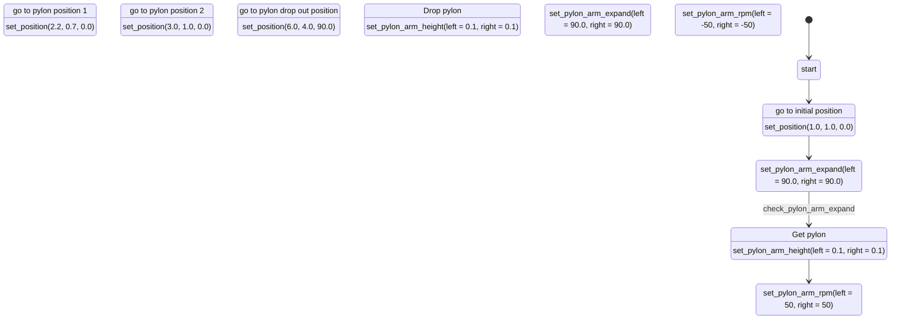

```mermaid
stateDiagram-v2

    position_initial : go to initial position
    position_initial : set_position(1.0, 1.0, 0.0)

    position_pylon_1 : go to pylon position 1
    position_pylon_1 : set_position(2.2, 0.7, 0.0)

    position_pylon_2 : go to pylon position 2
    position_pylon_2 : set_position(3.0, 1.0, 0.0)

    position_pylon_out : go to pylon drop out position
    position_pylon_out : set_position(6.0, 4.0, 90.0)


    get_pylon_height : Get pylon
    get_pylon_height : set_pylon_arm_height(left = 0.1, right = 0.1)
    get_pylon_expand : set_pylon_arm_expand(left = 90.0, right = 90.0)
    get_pylon_rpm : set_pylon_arm_rpm(left = 50, right = 50)

    drop_pylon_height : Drop pylon
    drop_pylon_height : set_pylon_arm_height(left = 0.1, right = 0.1)
    drop_pylon_expand : set_pylon_arm_expand(left = 90.0, right = 90.0)
    drop_pylon_rpm : set_pylon_arm_rpm(left = -50, right = -50)


    [*] --> start
    start --> position_initial
    position_initial --> get_pylon_expand
    get_pylon_expand --> get_pylon_height : check_pylon_arm_expand
    get_pylon_height --> get_pylon_rpm
#    get_pylon_rpm --> position_pylon_1
#    position_pylon_1 --> position_pylon_2
#    position_pylon_2 --> position_pylon_out
#    position_pylon_out --> drop_pylon_height
#    drop_pylon_height --> drop_pylon_expand
#    drop_pylon_expand --> drop_pylon_rpm
#    drop_pylon_rpm -->start
```
