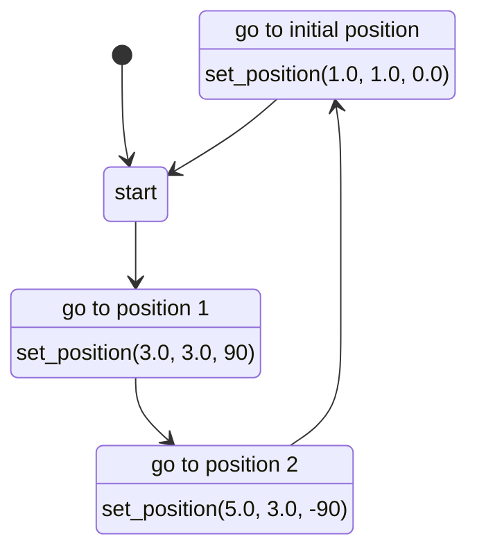

```mermaid
stateDiagram-v2

    position_0 : go to initial position
    position_0 : set_position(1.0, 1.0, 0.0)

    position_1 : go to position 1
    position_1 : set_position(3.0, 3.0, 90)

    position_2 : go to position 2
    position_2 : set_position(5.0, 3.0, -90)


    [*] --> start
    start --> position_1
    position_1 --> position_2
    position_2 --> position_0
    position_0 --> start
```
